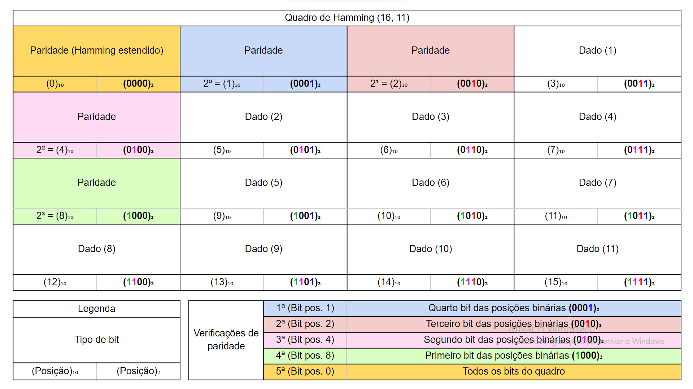

# Algoritmo de atribuição de resistência a erros

## Sumário
 - [Resumo](#resumo)
 - [Hamming](#hamming)
 - [Organização do código](#organização-e-funcionamento-do-código)
   - [Diretórios](#diretórios)
   - [Sender](#sender)
     - [Criar-quadro](#função-para-criar-um-quadro-de-hamming)
     - [Criar-cabeçalho](#função-para-criar-o-cabeçalho)
     - [Criar-arquivo-codificado](#procedimento-para-criar-o-arquivo-codificado)
   - [Receiver](#receiver)
     - [Flipar-bit](#função-para-flipar-um-bit)
     - [Decodificar-quadro](#função-para-decodificar-um-quadro)
     - [Ler-cabeçalho](#função-para-ler-o-cabeçalho)
     - [Decodificar-arquivo](#procedimento-para-decodificar-um-arquivo-e-retorná-lo-ao-arquivo-original)

## Resumo
 Este repositório se trata de um trabalho da disciplina Fundamentos de Informática do curso de Bacharelado em Ciência da Computação do Instituto Federal Catarinense Campus Blumenau. <br>

 O trabalho envolve um algoritmo que atribui, a um dado arquivo, resistência a erros por meio do Código de Hamming.

## Hamming
 

 Para mais informações, acesse a [página da Wikipedia](https://pt.wikipedia.org/wiki/C%C3%B3digo_de_Hamming) que descreve o Código de Hamming

## Organização e funcionamento do código

 ### Diretórios
 * `files`: Armazena os arquivos manuseados pelo algoritmo.
 * `source`: Possui o código-fonte do algoritmo.

 ### Sender
 Caminho: `source\sender.py` <br>
 Módulo que aplica codificação de Hamming a um arquivo qualquer e o converte para um arquivo de texto em binário. O arquivo codificado ficará com aproximadamente 46% do tamanho do arquivo original. <br>

 #### Função para criar um quadro de Hamming:
 ```python
 def criar_quadro(bits_dados):
    """
    Recebe 11 bits de dados, calcula suas paridades e retorna uma string que representa um quadro de Hamming estendido
    """
    result = list(range(16))
    soma_primeiro_bit = 0
    i = 0
    xor_aplicado = 0
    # As posições j consideradas no laço são as posições dos bits de dados num quadro de Hamming já montado
    for j in [3, 5, 6, 7, 9, 10, 11, 12, 13, 14, 15]:
        # Armazena o bit de dado i em sua devida posição no quadro de Hamming
        result[j] = bits_dados[i]

        # Se o bit na posição i estiver ligado, então:
            # Soma o bit de dado i para posteriormente verificar a paridade do bit da posição 0 do quadro de Hamming estendido;
            # Aplica-se XOR considerando sua posição num quadro já montado.
        # Ao final do laço, xor_aplicado terá exatamente os bits de paridade de Hamming que devem estar ligados, porém em base decimal
        if int(bits_dados[i]):
            soma_primeiro_bit += 1
            xor_aplicado = xor_aplicado ^ j

        # Incrementa i para acessar a próxima posição do parâmetro bit_dados
        i += 1

    # Passa a variável xor_aplicado para binário, fatia a partir da posição 2 e adiciona zeros à esquerda para completar uma string de tamanho 4
    str_xor_aplicado = bin(xor_aplicado)[2:].zfill(4)

    i = 3
    # Cada k representa um bit de paridade de Hamming na posição 2 ** i
    for k in str_xor_aplicado:
        result[2**i] = k
        soma_primeiro_bit += int(k)
        i -= 1

    # O bit da posição 0 (Hamming estendido) recebe sua devida paridade considerando-se todos os bits ligados até então
    result[0] = str(soma_primeiro_bit % 2)

    return ''.join(result)
 ```

 Ao criar um arquivo codificado, Sender também cria um cabeçalho que armazena o tamanho do arquivo, o tamanho do cabeçalho e a extensão (.jpg, .png) do arquivo original. Após isto, o cola no começo do arquivo codificado. <br>

 #### Função para criar o cabeçalho:
 ```python
 def criar_cabecalho(arquivo):
    cabecalho = ''
    extensao = arquivo.split('.')[1]

    t = os.path.getsize(f"{arquivo}")
    # with open(arquivo, 'rb') as file:
    #     while True:
    #         dado = file.read(1)
    #         if str(dado) == "b''":
    #             break
    #         t += 1

    t *= 8
    resto = t % 11
    final = (t - resto) + ( 5 * (t // 11)) + resto
    extensao += '-'
    extensao += str(final)
    extensao += '-'

    bits_cabecalho = ''
    for i in extensao:
        b = format(ord(i),'b')
        b = '0' * ( 8 - len(b)) + b
        bits_cabecalho += b

    chave = 'bcc2022'
    stringC = ''
    for i in chave:
        b = format(ord(i),'b')
        b = '0' * ( 8 - len(b)) + b
        stringC += b


    repetir_cabecalho = 10
    tamanho_cabecalho = (len(stringC) * (repetir_cabecalho + 2))
    tamanho_cabecalho += len(bits_cabecalho) * repetir_cabecalho
    tamanho_cabecalho += len(str(tamanho_cabecalho)*8) * repetir_cabecalho


    stringT = ''
    for i in str(tamanho_cabecalho):
        b = format(ord(i),'b')
        b = '0' * ( 8 - len(b)) + b
        stringT += b

    cabecalho += stringC
    for i in range(repetir_cabecalho):
        cabecalho += stringC
        cabecalho += bits_cabecalho
        cabecalho += stringT
    cabecalho += stringC

    return cabecalho
 ```

 #### Procedimento para criar o arquivo codificado:
 ```python
 def codificarArquivo(caminho_arquivo_original: str, caminho_arquivo_codificado='codificado.bin'):
    """
    Converte um arquivo qualquer em um arquivo binário e aplica codificação de Hamming.
    """
    with open(caminho_arquivo_codificado, 'wb') as arq_codificado:
        cabecalho = criar_cabecalho(caminho_arquivo_original)
        i = 0
        while True:
            cabecalho_cortado = cabecalho[i:i+8]
            if len(cabecalho_cortado) == 0:
                break
            arq_codificado.write(int(cabecalho_cortado, base=2).to_bytes(1, byteorder='big'))
            i += 8

        bytes_formatados = ''
        with open(caminho_arquivo_original, 'rb') as arq_original:
            while True:
                dado = arq_original.read(1)
                if str(dado) == "b''":
                    break
                byte_formatado = format(ord(dado), '08b')
                # byte = byte.zfill(8)
                bytes_formatados += byte_formatado
                if len(bytes_formatados) >= 11:
                    quadro = criar_quadro(bytes_formatados[:11])
                    arq_codificado.write(int(quadro, base=2).to_bytes(2, byteorder='big'))
                    bytes_formatados = bytes_formatados[11:]

            arq_codificado.write(int(bytes_formatados, base=2).to_bytes(2, byteorder='big'))
 ```

 ### Receiver
 Caminho: `source\receiver.py` <br>
 Lê um arquivo de texto codificado, decodifica e converte de volta para o arquivo original. <br>
 Ao converter o arquivo de texto codificado de volta para o arquivo original, ao ler cada quadro o algoritmo:
 - Extrai os bits de dados do quadro e os escreve se não houver erros.
 - Corrige o quadro, extrai os bits de dados e os escreve se houver 1 erro.
 - Escreve uma sequência de 11 bits desligados ('00000000000') se o quadro tiver 2 ou mais erros. <br>

 LIMITAÇÃO: <br>
  Se o algoritmo detectar uma quantidade de erros ímpar diferente de 1, ele tentará corrigir o quadro e escreverá seus bits de dados na conversão para o arquivo original. Desta forma, o arquivo original pode se corromper.

 #### Função para flipar um bit:
```python
def retornar_quadro_bit_flipado(quadro, posicao):
    """
    Recebe um quadro de Hamming estendido e retorna uma lista igual ao quadro, porém com o bit na posição especificada flipado
    """
    result = list(quadro)
    if quadro[posicao] == '1':
        result[posicao] = '0'
    else:
        result[posicao] = '1'

    return result
```

 #### Função para decodificar um quadro:
```python
def decodificar_quadro(quadro):
    """
    Recebe um quadro de Hamming estendido (16 bits) e retorna:

    * Os bits de dados em string e False se o algoritmo não detectar erro;\n
    * String vazia e False se o algoritmo detectar erro mas não determinar sua posição;\n
    * Os bits de dados em string já corrigidos e True se o algoritmo detectar erro e determinar sua posição.

    - O segundo retorno é do tipo booleano e recebe True se o algoritmo efetuar a correção do quadro.

    LIMITAÇÃO: Se o algoritmo determinar a posição do erro e houver um número ímpar de erros diferente de 1, ele retornará os bits de dados corrigidos por uma suposta posição de erro. Desta forma, ele retorna os bits de dados corrigidos de uma maneira não acertiva!
    """
    posicoes_bits_dados = [3, 5, 6, 7, 9, 10, 11, 12, 13, 14, 15]
    bits_dados = []
    soma_primeiro_bit = int(quadro[0])
    posicao_erro = 0

    # Para o próximo laço, não é considerada a posição do primeiro bit do quadro
    for i in range(1, 16):
        if i in posicoes_bits_dados:
            bits_dados.append(quadro[i])

        # Se o bit na posição i estiver ligado, então:
            # Soma o bit de dado i para posteriormente verificar a paridade do bit da posição 0 do quadro de Hamming estendido;
            # Aplica-se XOR à variável posicao_erro e à posição i do bit ligado.
        # Ao final do laço, a variável posicao_erro terá exatamente a posição do erro detectado em decimal
        if int(quadro[i]):
            soma_primeiro_bit += 1
            posicao_erro = posicao_erro ^ i

    # Se a soma de todos os bits ligados for par, quadro_eh_par recebe True. Caso contrário, quadro_eh_par recebe False
    quadro_eh_par = True if soma_primeiro_bit % 2 == 0 else False

    # Se não for detectado erro, retorna os bits de dados
    if   posicao_erro == 0 and quadro_eh_par:
        return ''.join(bits_dados), False

    # Se for detectado 2 ou mais erros, retorna string vazia
    elif (posicao_erro != 0 and quadro_eh_par) or (posicao_erro == 0 and not quadro_eh_par):
        return '', False

    # Se for detectado 1 erro, flipa o bit incorreto e retorna os bits de dados
    else:
        bit_dados = []
        quadro_bit_flipado = retornar_quadro_bit_flipado(quadro, posicao_erro)
        for i in posicoes_bits_dados:
            bit_dados.append(quadro_bit_flipado[i])

        return ''.join(bit_dados), True
```

 #### Função para ler o cabeçalho:
```python
def ler_cabecalho(t):
    chave = 'bcc2022'
    stringC = ''
    for i in chave:
        b = format(ord(i),'b')
        b = '0' * ( 8 - len(b)) + b
        stringC += b
    cabecalhos = []
    f = ''
    data = ''
    on = False
    for index, i in enumerate(t):
        f += i
        if len(f) > len(stringC):
            f = f[1:]
        if not on:
            data += i
        if f == stringC:
            if not on:
                on = False
                bits = ''
                dados = ''
                for cada in data:
                    bits += cada
                    if len(bits) == 8:
                        dados += chr(int(bits,2))
                        bits = ''
                data = ''
                final = dados[:len(dados) - len(chave)]
                if final != '':
                    cabecalhos.append(final)
            else:
                on = True
    certo = ''
    for ix,x in enumerate(cabecalhos):
        for iy,y in enumerate(cabecalhos):
            if x == y and ix != iy:
                certo = x
    return certo
```

 #### Procedimento para decodificar um arquivo e retorná-lo ao arquivo original:
```python
def decodificar_arquivo(caminho_arquivo_codificado: str, caminho_arquivo_recriado='original'):
    """
    Decodifica um arquivo especificado e recria o arquivo original (antes de ser codificado).

    Se decodificar_quadro detectar um quadro corrompido, decodificar_arquivo adiciona 11 bits desligados na conversão para o arquivo original ao invés dos dados de um quadro corrompido.
    """
    inicio_arquivo = 0
    cabecalho = ''
    with open(caminho_arquivo_codificado, 'rb') as arq_codificado:
        i = 0
        while i <= 375:
            dado = arq_codificado.read(1)
            byte_formatado = format(ord(dado), '08b')
            cabecalho += byte_formatado
            i += 1

    dados_cabecalho = ler_cabecalho(cabecalho).split('-')
    extensao = dados_cabecalho[0]
    tamanho_arquivo = int(dados_cabecalho[1])
    inicio_arquivo = int(dados_cabecalho[2])

    with open(caminho_arquivo_recriado + '.' + extensao, 'wb') as arq_original:
        with open(caminho_arquivo_codificado, 'rb') as arq_codificado:
            contador_tamanho = 0
            byte_formatado = ''
            bytes_formatados = ''
            dados = ''
            efetuou_correcao = False
            contador_quadros_verificados = 0
            contador_quadros_corrigidos = 0
            contador_quadros_corrompidos = 0
            bytesArray = bytearray()
            escrever = False
            while True:
                dado = arq_codificado.read(1)
                # if str(dado) == "b''":
                #     break
                contador_tamanho += 8
                if tamanho_arquivo <= (contador_tamanho - inicio_arquivo):
                    break
                byte_formatado = format(ord(dado), '08b')
                bytes_formatados += byte_formatado
                if len(bytes_formatados) == inicio_arquivo and not escrever:
                    escrever = True
                    bytes_formatados = ''
                if escrever:
                    if len(bytes_formatados) == 16:
                        novos_dados, efetuou_correcao = decodificar_quadro(bytes_formatados)
                        contador_quadros_verificados += 1
                        if novos_dados != '' and not efetuou_correcao:
                            dados += novos_dados
                        elif novos_dados != '' and efetuou_correcao:
                            contador_quadros_corrigidos += 1
                            dados += novos_dados
                        else:
                            contador_quadros_corrompidos += 1
                            dados += '00000000000'
                        bytes_formatados = ''
                    if len(dados) >= 8:
                        bytesArray.append(int(dados[:8], 2))
                        dados = dados[8:]
                    if len(bytesArray) >= 16:
                        arq_original.write(bytesArray)
                        bytesArray = bytearray()
            if len(dados) != 8:
                contador_tamanho -= len(dados)

            bytesArray.append(int(dados[:8], 2))

            arq_original.write(bytesArray)

    diferenca_tamanho = (contador_tamanho - inicio_arquivo) - tamanho_arquivo
    if diferenca_tamanho != 0:
        print('*Foi detectada uma diferença de', diferenca_tamanho, 'bits ao comparar o tamanho do arquivo codificado armazenado em seu cabeçalho e seu atual tamanho. O arquivo pode estar corrompido')

    print("Quantidade de quadros verificados:", contador_quadros_verificados)
    print("Quantidade de quadros corrompidos:", contador_quadros_corrompidos)
    print("Quantidade de quadros corrigidos:", contador_quadros_corrigidos)
```